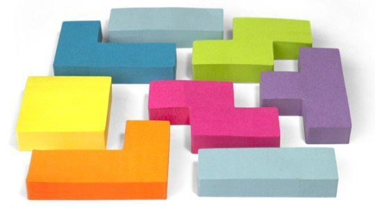

Test Driven Development
=================================
---

#### Objectives  
*	Learn how assertions to test if your *code* is working properly
*	Learn to write tests *before* writing your code
*	Apply using ```ears``` to write code that meets testing criteria

---

In this course, the example code that we write is usually very small, but in practice, developers divide even short scripts into logical "chunks" that work together.  Organizing code into concise chunks makes it easier to write or refactor your code one section at a time without getting lost.  It also means that your script or program works by connecting chunks of code together for some overall purpose, and it becomes critical that the pieces fit together well, like a puzzle.



Once developers are driven to break their code into logical chunks (and it doesn't matter if those chunks are functions or objects), the "interface" between chunks becomes increasingly important.  This leads to a few questions:

*	How can we be sure that our chunks fit together correctly?  
*	If another developer starts helping with code, how can we divide up work while keeping interoperability?

The best practice for solving these problems is to use unit tests to serve as a skeleton for your code.  Unit tests can both define what your program should do to give a correct result and what it should do by convention.  One possible technique for writing good unit tests is called "test-driven development."


## Using Tests as an Outline


Consider writing a function that gives the area of a rectangle:

For example:

```
def rectangle_area([x0, y0, x1, y1])
```

Before we ever write a line of code, we could ask the questions about how we want our function to handle various edge cases.

*	Should x0 always be less than x1?  What if it is not?
*	How should we handle rectangles with 0 volume?

Consider these examples:
<div>
<pre><code class="language-python"><span class="function"><span class="keyword">def</span> <span class="title">test_inverted_rectangle</span><span class="params">()</span>:</span>
    <span class="keyword">assert</span> rectangle_area([<span class="number">1</span>, <span class="number">5</span>, <span class="number">5</span>, <span class="number">2</span>]) == -<span class="number">12.0</span>
</code></pre>
</div>


<div>
<p>Is that test correct?
I.e.,
are rectangles with <code>x1&lt;x0</code> or <code>y1&lt;y0</code> legal,
and do they have negative area?
Or should the test be:</p>
</div>


<div>
<pre><code class="language-python"><span class="function"><span class="keyword">def</span> <span class="title">test_inverted_rectangle</span><span class="params">()</span>:</span>
    <span class="keyword">try</span>:
        rectangle_area([<span class="number">1</span>, <span class="number">5</span>, <span class="number">5</span>, <span class="number">2</span>])
        <span class="keyword">assert</span> <span class="built_in">False</span>, <span class="string">'Function did not raise exception for invalid rectangle'</span>
    <span class="keyword">except</span> ValueError:
        <span class="keyword">pass</span> <span class="comment"># rectangle_area failed with the expected kind of exception</span>
    <span class="keyword">except</span> Exception:
        <span class="keyword">assert</span> <span class="built_in">False</span>, <span class="string">'Function did not raise correct kind of exception for invalid rectangle'</span>
</code></pre>
</div>


<div>
<p>The logic in this second version may take a moment to work out,
but the idea is straightforward:
we want to check that <code>rectangle_area</code> raises a <code>ValueError</code> exception
if it&#39;s given a rectangle whose upper edge is below or to the left of its lower edge.</p>
<p>Here&#39;s another test case that can help us design our software:</p>
</div>


<div>
<pre><code class="language-python"><span class="function"><span class="keyword">def</span> <span class="title">test_zero_width</span><span class="params">()</span>:</span>
    <span class="keyword">assert</span> rectangle_area([<span class="number">2</span>, <span class="number">1</span>, <span class="number">2</span>, <span class="number">8</span>]) == <span class="number">0</span>
</code></pre>
</div>


<div>
<p>We might decide that rectangles with negative areas aren&#39;t allowed,
but what about rectangles with zero area,
i.e.,
rectangles that are actually lines?
Any actual implementation of <code>rectangle_area</code> will do <em>something</em> with one of these;
writing unit tests for boundary cases is a good way to specify exactly what that something is.</p>
<p>Unit tests are actually such a good way to define how functions ought to behave that
many programmers use a practice called <a href="glossary.html#test_driven_development">test-driven development</a> (TDD).
Instead of writing code,
then figuring out how to test it,
these programmers:</p>
<ol>
<li>write some unit tests for a function that doesn&#39;t exist yet,</li>
<li>write that function,</li>
<li>modify it until it passes all of the tests, then</li>
<li>clean up the function, i.e., make it more readable or more efficient without breaking any of the tests.</li>
</ol>
<p>The mantra often used during TDD is &quot;<a href="../../rules.html#red-green-refactor">red, green, refactor</a>&quot;:
get a red light (i.e., some failing tests),
make it turn green (i.e., get something working),
and then clean it up by refactoring.
This cycle should take anywhere from a couple of minutes to an hour or so.
If it takes longer than that,
the change being made is probably too large,
and should be broken down into smaller (and more comprehensible) steps.</p>
<p>TDD&#39;s proponents argue that it helps people produce better code for two reasons.
First,
it encourages them to write code in small, self-contained chunks,
and to actually write tests for those chunks.
Second,
it frees them from <a href="../../gloss.html#confirmation_bias">confirmation bias</a>:
since they haven&#39;t written their function yet,
their subconscious cannot steer their testing toward proving it correct
rather than finding errors.</p>
<p>Empirical studies of TDD have had mixed results:
some have found it beneficial,
while others have found no effect.
But even if you don&#39;t use it day to day,
trying it a few times helps you learn how to design functions and programs that are easier to test.</p>
</div>


### Challenge


*	Write a function called ```something``` that passes the following unit tests:

```
def test_empty():
    assert something([]) == []

def test_single_value():
    assert something(['a']) == []

def test_two_values():
    assert something(['a', 'b']) == [('a', 'b')]

def test_three_values():
    assert something(['a', 'b', 'c']) == [('a', 'b'), ('a', 'c'), ('b', 'c')]
```

##Next Steps
We have now seen the basics of building and testing Python code in the IPython Notebook. The last thing we need to learn is how to build command-line programs that we can use in pipelines and shell scripts, so that we can integrate our tools with other people's work. This will be the subject of our next and final lesson.